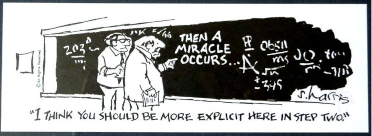

## History
* Browser wars
* Mozilla
* Reception

## Code Generation
* return (num | 0) -> Return integer instead of default double
* x
* xx

## Application
* Demo -- Browser frames-per-second sweep test

## Further Information
* [asm.js site](http://asmjs.org)

