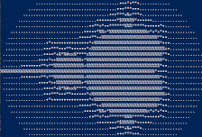

## Evolution 

01-original
From the book "Rust in Action"

02-tunable
Added x, y, z on the command line
Also cleaned up case values

03-to-wasm
Convert to WASM, interface to browser

04-browser-tunable
x, y, z changeable in browser
Added Robot demo task

